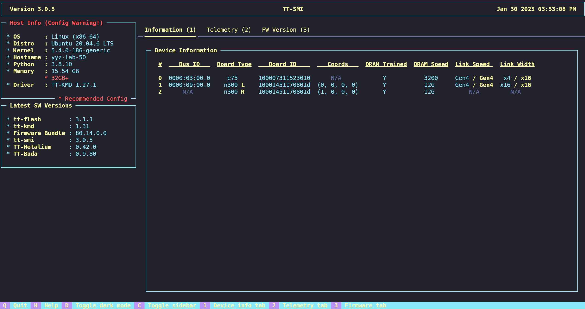
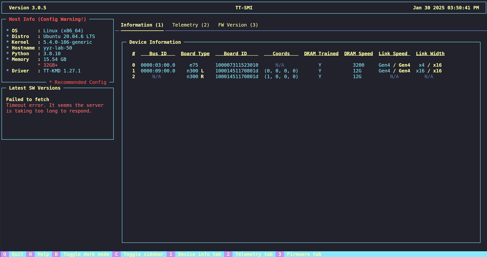
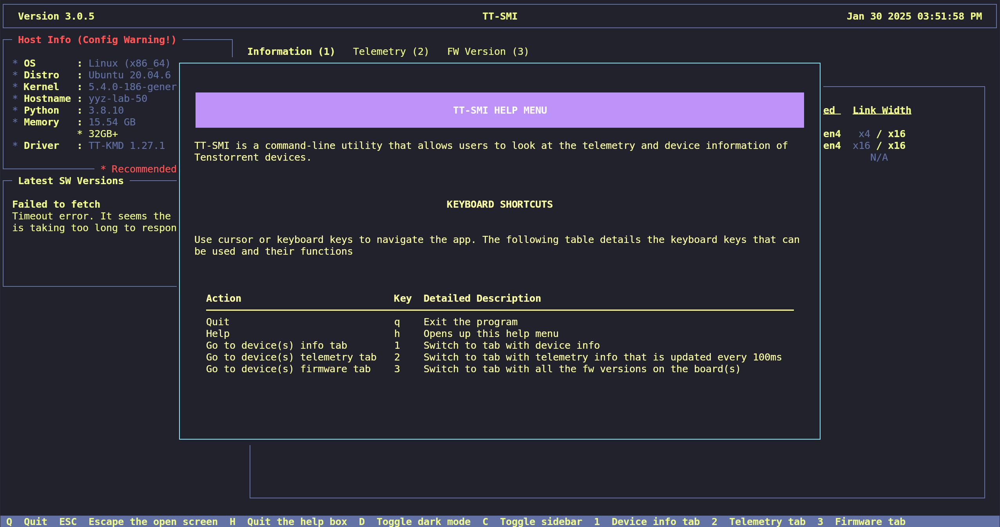

# TT-SMI

Tenstorrent System Management Interface (TT-SMI) is a command line utility
to interact with all Tenstorrent devices on host.

Main objective of TT-SMI is to provide a simple and easy to use interface
to collect and display device, telemetry and firmware information.

In addition user can issue Grayskull board Tensix core reset.

## Official Repository

[https://github.com/tenstorrent/tt-smi/](https://github.com/tenstorrent/tt-smi/)

# Getting started
Build and editing instruction are as follows -

### Building from Git

Install and source rust for the luwen library
```
curl --proto '=https' --tlsv1.2 -sSf https://sh.rustup.rs | sh
source "$HOME/.cargo/env"
```

### Optional
Generate and source a python environment.  This is useful not only to isolate
your environment, but potentially easier to debug and use.  This environment
can be shared if you want to use a single environment for all your Tenstorrent
tools

```
python3 -m venv .venv
source .venv/bin/activate
pip3 install --upgrade pip
```
### Required

Install tt-smi.
```
pip3 install .
```

### Optional - for TT-SMI developers

Generate and source a python3 environment
```
python3 -m venv .venv
source .venv/bin/activate
pip install --upgrade pip
pip install pre-commit
```

For users who would like to edit the code without re-building, install SMI in editable mode.
```
pip install --editable .
```
Recommended: install the pre-commit hooks so there is auto formatting for all files on committing.
```
pre-commit install
```

# Usage

Command line arguments
```
tt-smi [-h] [-l] [-v] [-s] [-ls] [-f [filename]] [-g] [-r 0,1 ... or config.json]
```
## Getting Help!

Running tt-smi with the ```-h, --help``` flag should bring up something that looks like this

```
$ tt-smi --help

  usage: tt-smi [-h] [-l] [-v] [-s] [-ls] [-f [filename]] [-g] [-r 0,1 ... or config.json]

  Tenstorrent System Management Interface (TT-SMI) is a command line utility to interact with all Tenstorrent devices on host. Main objective of TT-SMI is to provide a simple and easy to use interface to
  collect and display device, telemetry and firmware information. In addition user can issue Grayskull and Wormhole board level resets.

  optional arguments:
    -h, --help            show this help message and exit
    -l, --local           Run on local chips (Wormhole only)
    -v, --version         show program's version number and exit
    -s, --snapshot        Dump snapshot of current TT-SMI information to .json log.Default: ~/tt_smi/<timestamp>_snapshot.json User can use -f to change filename
    -ls, --list           List boards that are available on host and quits
    -f [filename], --filename [filename]
                          Change filename for test log. Default: ~/tt_smi/<timestamp>_snapshot.json
  -g [GENERATE_RESET_JSON], --generate_reset_json [GENERATE_RESET_JSON]
                        Generate default reset json file that reset consumes. Default stored at ~/.config/tenstorrent/reset_config.json. Update the generated file and use it as an
                        input for the --reset option
    -r 0,1 ... or config.json, --reset 0,1 ... or config.json
                          Provide list of PCI index or a json file with reset configs. Find PCI index of board using the -ls option. Generate a default reset json file with the -g option.
  ```

Some of these flags will be discussed in more detail in the following sections.

## GUI
To bring up the tt-smi GUI run
```
$ tt-smi
```
This should bring up a display that looks as below.



This is the default mode where user can see device information, telemetry and firmware.

### Latest SW Versions
This section will display the software version of the device. If failures occur, error messages will show as below.



### App keyboard shortcuts
All app keyboard shortcuts can be found in the help menu that user can bring up by hitting "h" or clicking the "help" button on the footer.



## Resets

Another feature of tt-smi is performing resets on Blackhole, Wormhole and Grayskull PCIe cards, using the  ```-r/ --reset``` argument. 

**WARNING for ARM systems.**
PCIe config is set up differently on those systems. Hence our current implementation of PCIe reset doesn't work as expected on them. It is recommended to reboot the system if you would like to perform a board reset on your ARM system.

```
$ tt-smi -r 0,1 ... or config.json, --reset 0,1 ... or config.json

    Provide list of PCI index or a json file with reset configs. Find PCI index of board using the -ls option. Generate a default reset json file with the -g option.
```

To perform the reset, either provide a list of comma separated values of the PCI index of the cards on the host, or an input reset_config.json file that can be generated using the ```-g/ --generate_reset_json``` command line argument.

TT-SMI will perform different types of resets depending on the device:
- Grayskull
  - Tensix level reset that will reset each Tensix cores.
- Wormhole
  - A board level reset will be perfomed. Power will be cut to the board and brought back up. 
  - Post reset the ethernet connections will be re-trained.
- Blackhole
  - A board level reset will be perfomed. Power will be cut to the board and brought back up. 

By default, the reset command will re-initialize the boards after reset. To disable this, update the json config file.


A successful reset on a system with both Wormhole and Grayskull should look something like the follows:

```
$ tt-smi -r 0,1

  Starting PCI link reset on WH devices at PCI indices: 1
  Finishing PCI link reset on WH devices at PCI indices: 1

  Starting Tensix reset on GS board at PCI index 0
  Lowering clks to safe value...
  Beginning reset sequence...
  Finishing reset sequence...
  Returning clks to original values...
  Finished Tensix reset on GS board at PCI index 0

  Re-initializing boards after reset....
 Done! Detected 3 boards on host.
```
OR
```
tt-smi -r reset_config.json

  Starting PCI link reset on WH devices at PCI indices: 1
  Finishing PCI link reset on WH devices at PCI indices: 1

  Starting Tensix reset on GS board at PCI index 0
  Lowering clks to safe value...
  Beginning reset sequence...
  Finishing reset sequence...
  Returning clks to original values...
  Finished Tensix reset on GS board at PCI index 0

  Re-initializing boards after reset....
  Done! Detected 3 boards on host.

```

In order to find the correct board dev id to call the reset on, the user can use the tt-smi board list function `tt-smi -ls` or `tt-smi --list`. The dev id listed is the same as found on `/dev/tenstorrent/<dev pci id>`
The generated output will include a list of all boards on host as well as the ones that can be reset.

```
$ tt-smi -ls

Gathering Information ━━━━━━━━━━━━━━━━━━━━━━━━━━━━━━━━━━━━━━━━ 100% 0:00:00
                All available boards on host:
┏━━━━━━━━━━━━┳━━━━━━━━━━━━┳━━━━━━━━━━━━━━━┳━━━━━━━━━━━━━━━━━━┓
┃ PCI Dev ID ┃ Board Type ┃ Device Series ┃ Board Number     ┃
┡━━━━━━━━━━━━╇━━━━━━━━━━━━╇━━━━━━━━━━━━━━━╇━━━━━━━━━━━━━━━━━━┩
│ 0          │ Grayskull  │ e75           │ 0100007311523010 │
│ 1          │ Wormhole   │ n300 L        │ 010001451170801d │
│ N/A        │ Wormhole   │ n300 R        │ 010001451170801d │
└────────────┴────────────┴───────────────┴──────────────────┘
                  Boards that can be reset:
┏━━━━━━━━━━━━┳━━━━━━━━━━━━┳━━━━━━━━━━━━━━━┳━━━━━━━━━━━━━━━━━━┓
┃ PCI Dev ID ┃ Board Type ┃ Device Series ┃ Board Number     ┃
┡━━━━━━━━━━━━╇━━━━━━━━━━━━╇━━━━━━━━━━━━━━━╇━━━━━━━━━━━━━━━━━━┩
│ 0          │ Grayskull  │ e75           │ 0100007311523010 │
│ 1          │ Wormhole   │ n300 L        │ 010001451170801d │
└────────────┴────────────┴───────────────┴──────────────────┘
```
### Disabling SW version reporting

To disable the reporting of software versions and reporting of serial numbers, you can update the following parameters in the reset config file. The reset file can be generated into  ```~/.config/tenstorrent/reset_config.json``` using ``` tt-smi -g``` and then updated as follows :

```
    "disable_serial_report": false,     // make this true
    "disable_sw_version_report": false, // make this true
```

If the ```disable_sw_version_report``` is set to true, all the software versions in the ```Latest SW Versions``` block get reported as "N/A".


## Snapshots

TT-SMI provides an easy way to get all the information that is displayed on the GUI in a json file, using the ```-s, --snapshot``` argument. By default the file is named and stored as
``` ~/tt_smi/<timestamp>_snapshot.json```. User can also provide their own filename if desired, using the ```-f``` option. 
If you don't want to pipe the output to a file, you can use ```tt-smi -f -```. It behaves like ```tt-smi -s```,printing snapshot info directly to STDOUT.

Example usage:
```
$ tt-smi -s -f tt_smi_example.json

    Gathering Information ━━━━━━━━━━━━━━━━━━━━━━━━━━━━━━━━━━━━━━━━ 100% 0:00:00
      Saved tt-smi log to: tt_smi_example.json
```

```
$ tt-smi -f -

    Gathering Information ━━━━━━━━━━━━━━━━━━━━━━━━━━━━━━━━━━━━━━━━ 100% 0:00:00
    {
        "time": "2025-02-04T13:04:50.313105",
        "host_info": {
            "OS": "Linux",
            "Distro": "Ubuntu 20.04.6 LTS",
            "Kernel": "5.15.0-130-generic",
        .........
```

## License

Apache 2.0 - https://www.apache.org/licenses/LICENSE-2.0.txt
